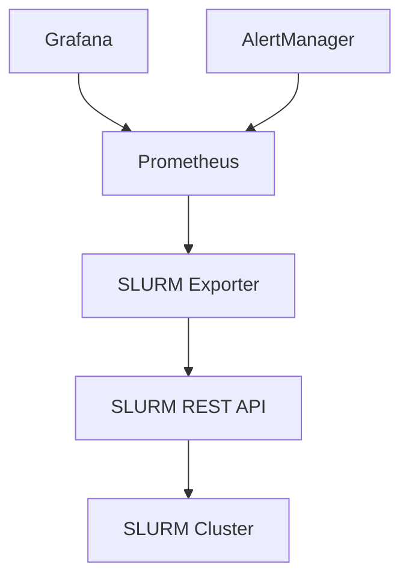
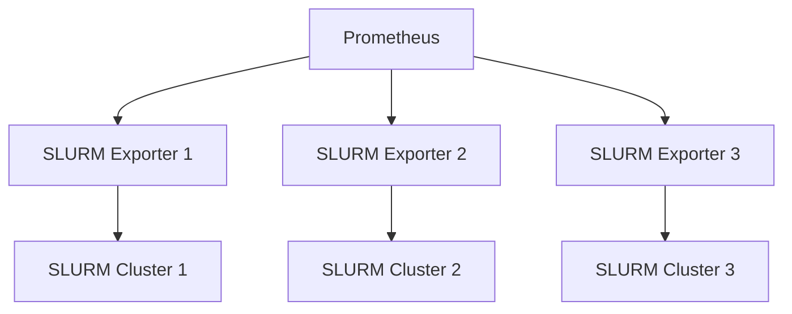
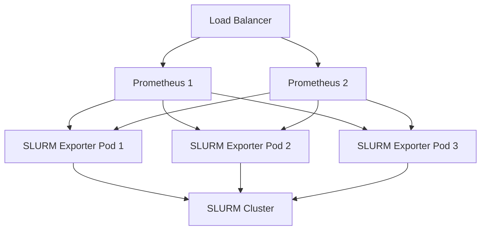
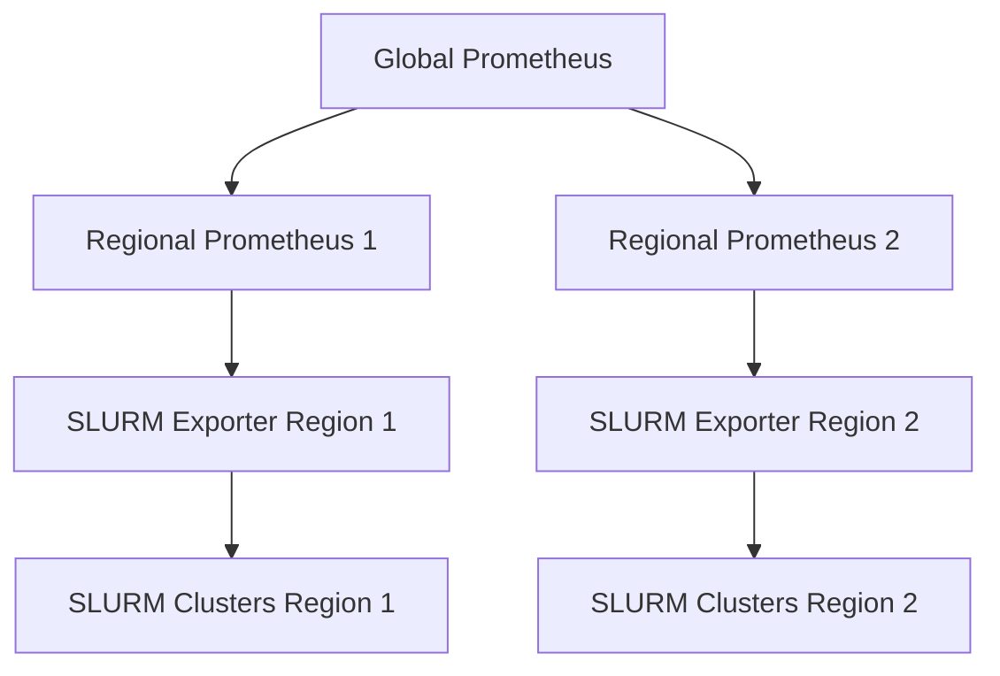

# SLURM Exporter Installation Guide

This comprehensive guide covers installation, configuration, and deployment of the SLURM Prometheus Exporter across different environments.

## Table of Contents

- [Prerequisites](#prerequisites)
- [Quick Start](#quick-start)
- [Installation Methods](#installation-methods)
- [Configuration](#configuration)
- [Deployment Scenarios](#deployment-scenarios)
- [Verification](#verification)
- [Troubleshooting](#troubleshooting)
- [Next Steps](#next-steps)

## Prerequisites

### System Requirements

#### Minimum Requirements
- **CPU**: 100m (0.1 core)
- **Memory**: 128Mi RAM
- **Storage**: 1Gi for logs and cache
- **Network**: Access to SLURM REST API endpoint

#### Recommended for Production
- **CPU**: 500m (0.5 core)
- **Memory**: 512Mi RAM
- **Storage**: 5Gi for persistent data
- **Network**: Reliable, low-latency connection to SLURM cluster

### SLURM Environment

#### SLURM Version Support
- **Supported**: SLURM 20.11+ with REST API enabled
- **Tested**: SLURM 21.08, 22.05, 23.02, 23.11, 24.05, 25.11
- **REST API Versions**: v0.0.40 - v0.0.44

#### SLURM REST API Configuration
The SLURM REST API must be configured and running:

```bash
# Check if SLURM REST API is available
curl -f http://your-slurm-server:6820/slurm/v0.0.40/ping

# Expected response:
{"pings": [{"hostname": "slurm-server", "ping": "UP", "status": 0}]}
```

**SLURM Configuration Requirements:**
```ini
# In slurm.conf
AccountingStorageType=accounting_storage/slurmdbd
JobAcctGatherType=jobacct_gather/linux
ProctrackType=proctrack/cgroup

# REST API daemon configuration
# In slurmrestd.service or manual startup
slurmrestd -vvv 0.0.0.0:6820
```

### Authentication Requirements

#### JWT Token Authentication (Recommended)
```bash
# Generate JWT token
sacctmgr show user $USER format=user,defaultaccount

# Create token
scontrol token username=$USER

# Or use service account
sacctmgr add user prometheus-exporter account=monitoring
scontrol token username=prometheus-exporter
```

#### API Key Authentication
```bash
# Generate API key in SLURM
sacctmgr add user prometheus-exporter account=monitoring
# Set API key in SLURM database
```

#### Basic Authentication
```bash
# Use existing SLURM user credentials
# Ensure user has appropriate permissions
```

### Kubernetes Environment (for Kubernetes deployment)

#### Kubernetes Version Support
- **Minimum**: Kubernetes 1.20+
- **Recommended**: Kubernetes 1.25+
- **Tested**: 1.24, 1.25, 1.26, 1.27

#### Required Kubernetes Components
```bash
# Check kubectl access
kubectl version --client
kubectl cluster-info

# Verify RBAC is enabled
kubectl auth can-i create deployments --as=system:serviceaccount:monitoring:default -n monitoring

# Check for storage classes
kubectl get storageclass
```

#### Helm Requirements (for Helm deployment)
```bash
# Install Helm 3.x
curl https://raw.githubusercontent.com/helm/helm/main/scripts/get-helm-3 | bash

# Verify Helm installation
helm version
```

### Monitoring Stack Prerequisites

#### Prometheus Operator (Recommended)
```bash
# Check if Prometheus Operator is installed
kubectl get crd prometheuses.monitoring.coreos.com

# If not installed, install Prometheus Operator
helm repo add prometheus-community https://prometheus-community.github.io/helm-charts
helm repo update
helm install prometheus-operator prometheus-community/kube-prometheus-stack -n monitoring --create-namespace
```

#### Standalone Prometheus
```yaml
# Add SLURM Exporter to prometheus.yml
scrape_configs:
  - job_name: 'slurm-exporter'
    static_configs:
      - targets: ['slurm-exporter:8080']
    scrape_interval: 30s
    scrape_timeout: 10s
```

### Development Environment (Optional)

#### Required Tools
```bash
# Go development (for building from source)
go version  # Go 1.21+

# Docker (for containerized deployment)
docker --version

# Make (for build automation)
make --version

# Git (for source code)
git --version
```

## Quick Start

### 1. Deploy with Helm (Recommended)

```bash
# Use the local chart from the repository
git clone https://github.com/jontk/slurm-exporter.git
cd slurm-exporter

# Deploy to development environment
helm install slurm-exporter ./charts/slurm-exporter \
  --namespace monitoring \
  --create-namespace \
  --set config.slurm.base_url="http://your-slurm-server:6820" \
  --set config.slurm.auth.type="jwt" \
  --set config.slurm.auth.username="your-slurm-user" \
  --set config.slurm.auth.token="your-jwt-token"

# Verify deployment
kubectl get pods -n monitoring -l app.kubernetes.io/name=slurm-exporter
```

### 2. Deploy with Docker Compose

```bash
# Clone repository
git clone https://github.com/jontk/slurm-exporter.git
cd slurm-exporter

# Create a config.yaml with your SLURM configuration (see Configuration section below)

# Start services
docker-compose up -d

# Access metrics
curl http://localhost:8080/metrics
```

### 3. Binary Installation

```bash
# Download latest release
wget https://github.com/jontk/slurm-exporter/releases/download/latest/slurm-exporter-linux-amd64.tar.gz
tar xzf slurm-exporter-linux-amd64.tar.gz

# Create configuration
cat > config.yaml << EOF
server:
  address: ":8080"

slurm:
  base_url: "http://your-slurm-server:6820"
  api_version: "v0.0.44"
  timeout: 30s
  retry_attempts: 3
  auth:
    type: "jwt"
    username: "your-slurm-user"
    token: "your-jwt-token"

collectors:
  cluster:
    enabled: true
    interval: 30s
  nodes:
    enabled: true
    interval: 60s
  jobs:
    enabled: true
    interval: 30s

validation:
  allow_insecure_connections: true
EOF

# Run exporter
./slurm-exporter --config config.yaml
```

## Installation Methods

### Method 1: Helm Chart (Production Recommended)

#### Development Environment
```bash
# Clone repository
git clone https://github.com/jontk/slurm-exporter.git
cd slurm-exporter

# Install in development mode
helm install slurm-exporter ./charts/slurm-exporter \
  --namespace monitoring \
  --create-namespace \
  --values charts/slurm-exporter/values-development.yaml \
  --set config.slurm.base_url="http://slurm-dev:6820" \
  --set config.slurm.auth.username="your-slurm-user" \
  --set config.slurm.auth.token="dev-token"
```

#### Production Environment
```bash
# Create production values file
cat > production-values.yaml << EOF
replicaCount: 3

resources:
  limits:
    cpu: 1000m
    memory: 1Gi
  requests:
    cpu: 500m
    memory: 512Mi

config:
  slurm:
    base_url: "https://slurm-prod.company.com:6820"
    api_version: "v0.0.44"
    timeout: 45s
    retry_attempts: 5
    auth:
      type: "jwt"
      tokenSecretName: "slurm-jwt-token"
      tokenSecretKey: "token"

  collectors:
    cluster:
      enabled: true
      interval: 30s
    nodes:
      enabled: true
      interval: 60s
    jobs:
      enabled: true
      interval: 30s

  server:
    tls:
      enabled: true
      secretName: "slurm-exporter-tls"

serviceMonitor:
  enabled: true

prometheusRule:
  enabled: true

podDisruptionBudget:
  enabled: true
  minAvailable: 1

networkPolicy:
  enabled: true
EOF

# Deploy to production
helm install slurm-exporter ./charts/slurm-exporter \
  --namespace monitoring \
  --create-namespace \
  --values production-values.yaml \
  --wait \
  --timeout 300s
```

### Method 2: Kubernetes Manifests

#### Create Namespace and RBAC
```bash
kubectl apply -f - << EOF
apiVersion: v1
kind: Namespace
metadata:
  name: monitoring
  labels:
    name: monitoring
---
apiVersion: v1
kind: ServiceAccount
metadata:
  name: slurm-exporter
  namespace: monitoring
---
apiVersion: rbac.authorization.k8s.io/v1
kind: ClusterRole
metadata:
  name: slurm-exporter
rules:
- apiGroups: [""]
  resources: ["pods", "services", "endpoints"]
  verbs: ["get", "list", "watch"]
---
apiVersion: rbac.authorization.k8s.io/v1
kind: ClusterRoleBinding
metadata:
  name: slurm-exporter
roleRef:
  apiGroup: rbac.authorization.k8s.io
  kind: ClusterRole
  name: slurm-exporter
subjects:
- kind: ServiceAccount
  name: slurm-exporter
  namespace: monitoring
EOF
```

#### Deploy Application
```bash
# Apply all Kubernetes manifests
kubectl apply -f k8s/

# Or apply individually
kubectl apply -f k8s/configmap.yaml
kubectl apply -f k8s/secrets.yaml
kubectl apply -f k8s/deployment.yaml
kubectl apply -f k8s/service.yaml
kubectl apply -f k8s/servicemonitor.yaml
```

### Method 3: Docker Compose

#### Development Setup
```bash
# Clone repository
git clone https://github.com/jontk/slurm-exporter.git
cd slurm-exporter

# Create a configuration file
cat > config.yaml << EOF
server:
  address: ":8080"

slurm:
  base_url: "http://your-slurm-server:6820"
  api_version: "v0.0.44"
  timeout: 30s
  retry_attempts: 3
  auth:
    type: "jwt"
    username: "your-slurm-user"
    token: "your-jwt-token"

collectors:
  cluster:
    enabled: true
  nodes:
    enabled: true
  jobs:
    enabled: true

logging:
  level: "info"
  format: "text"

validation:
  allow_insecure_connections: true
EOF

# Start development stack
docker-compose up -d

# View logs
docker-compose logs -f slurm-exporter

# Access services
# Exporter: http://localhost:8080
# Prometheus: http://localhost:9090
# Grafana: http://localhost:3000 (admin/admin)
```

#### Production Docker Compose
```yaml
# docker-compose.prod.yml
version: '3.8'

services:
  slurm-exporter:
    image: ghcr.io/jontk/slurm-exporter:latest
    restart: unless-stopped
    ports:
      - "8080:8080"
    environment:
      - SLURM_EXPORTER_SLURM_BASE_URL=https://slurm-prod:6820
      - SLURM_EXPORTER_SLURM_AUTH_TYPE=jwt
      - SLURM_EXPORTER_SLURM_AUTH_TOKEN_FILE=/run/secrets/slurm_token
      - SLURM_EXPORTER_SLURM_AUTH_USERNAME=prometheus-exporter
      - SLURM_EXPORTER_LOGGING_LEVEL=warn
    secrets:
      - slurm_token
    healthcheck:
      test: ["CMD", "wget", "--quiet", "--tries=1", "--spider", "http://localhost:8080/health"]
      interval: 30s
      timeout: 10s
      retries: 3
      start_period: 40s
    deploy:
      replicas: 2
      restart_policy:
        condition: any
        delay: 5s
        max_attempts: 3
      resources:
        limits:
          cpus: '1.0'
          memory: 1G
        reservations:
          cpus: '0.5'
          memory: 512M

secrets:
  slurm_token:
    external: true
```

### Method 4: Binary Installation

#### System Service Installation
```bash
# Download and install binary
wget https://github.com/jontk/slurm-exporter/releases/download/latest/slurm-exporter-linux-amd64.tar.gz
tar xzf slurm-exporter-linux-amd64.tar.gz
sudo cp slurm-exporter /usr/local/bin/
sudo chmod +x /usr/local/bin/slurm-exporter

# Create user and directories
sudo useradd --system --no-create-home --shell /bin/false slurm-exporter
sudo mkdir -p /etc/slurm-exporter /var/lib/slurm-exporter /var/log/slurm-exporter
sudo chown slurm-exporter:slurm-exporter /var/lib/slurm-exporter /var/log/slurm-exporter

# Create configuration
sudo tee /etc/slurm-exporter/config.yaml << EOF
server:
  address: ":8080"
  read_timeout: 30s
  write_timeout: 30s

slurm:
  base_url: "http://your-slurm-server:6820"
  api_version: "v0.0.44"
  timeout: 30s
  retry_attempts: 3
  auth:
    type: "jwt"
    username: "your-slurm-user"
    token: "your-jwt-token"

collectors:
  cluster:
    enabled: true
    interval: 30s
  nodes:
    enabled: true
    interval: 60s
  jobs:
    enabled: true
    interval: 30s

logging:
  level: "info"
  format: "json"
  output: "file"
  file: "/var/log/slurm-exporter/exporter.log"

validation:
  allow_insecure_connections: true
EOF

# Create systemd service
sudo tee /etc/systemd/system/slurm-exporter.service << EOF
[Unit]
Description=SLURM Prometheus Exporter
Documentation=https://github.com/jontk/slurm-exporter
Wants=network-online.target
After=network-online.target

[Service]
Type=simple
User=slurm-exporter
Group=slurm-exporter
ExecStart=/usr/local/bin/slurm-exporter --config /etc/slurm-exporter/config.yaml
Restart=on-failure
RestartSec=5
WorkingDirectory=/var/lib/slurm-exporter

# Security settings
NoNewPrivileges=yes
PrivateTmp=yes
ProtectSystem=strict
ProtectHome=yes
ReadWritePaths=/var/lib/slurm-exporter /var/log/slurm-exporter
CapabilityBoundingSet=

[Install]
WantedBy=multi-user.target
EOF

# Enable and start service
sudo systemctl daemon-reload
sudo systemctl enable slurm-exporter
sudo systemctl start slurm-exporter
sudo systemctl status slurm-exporter
```

## Configuration

### Environment-Specific Configuration

#### Development Configuration
```yaml
# config/dev-config.yaml
server:
  address: ":8080"
  read_timeout: 30s

slurm:
  base_url: "http://localhost:6820"
  api_version: "v0.0.44"
  timeout: 15s
  retry_attempts: 2
  auth:
    type: "none"  # No auth for development

collectors:
  cluster:
    enabled: true
    interval: 30s
  nodes:
    enabled: true
    interval: 60s
  jobs:
    enabled: true
    interval: 15s

logging:
  level: "debug"
  format: "text"

validation:
  allow_insecure_connections: true
```

#### Production Configuration
```yaml
# config/prod-config.yaml
server:
  address: ":8080"
  read_timeout: 30s
  write_timeout: 30s
  tls:
    enabled: true
    cert_file: "/etc/ssl/certs/server.crt"
    key_file: "/etc/ssl/private/server.key"

slurm:
  base_url: "https://slurm-prod.company.com:6820"
  api_version: "v0.0.44"
  timeout: 45s
  retry_attempts: 5
  auth:
    type: "jwt"
    username: "prometheus-exporter"
    token_file: "/run/secrets/slurm-token"

collectors:
  cluster:
    enabled: true
    interval: 30s
    timeout: 20s
  nodes:
    enabled: true
    interval: 60s
    timeout: 45s
  jobs:
    enabled: true
    interval: 30s
    timeout: 25s

logging:
  level: "warn"
  format: "json"
  output: "file"
  file: "/var/log/slurm-exporter/exporter.log"
  max_size: 100  # MB
  max_backups: 5
  max_age: 30    # days
```

### Authentication Configuration

#### JWT Token Authentication
```yaml
slurm:
  auth:
    type: "jwt"
    username: "prometheus-exporter"  # Sets the X-SLURM-USER-NAME header
    token: "eyJ0eXAiOiJKV1QiLCJhbGc..."  # Direct token (sets X-SLURM-USER-TOKEN)
    # OR
    token_file: "/run/secrets/slurm-token"  # Token from file
```

#### API Key Authentication
```yaml
slurm:
  auth:
    type: "apikey"
    api_key: "your-api-key"
    # OR
    api_key_file: "/run/secrets/slurm-apikey"
```

#### Basic Authentication
```yaml
slurm:
  auth:
    type: "basic"
    username: "prometheus-user"
    password: "secure-password"
    # OR
    password_file: "/run/secrets/slurm-password"
```

### Secret Management

#### Kubernetes Secrets
```bash
# Create JWT token secret
kubectl create secret generic slurm-jwt-token \
  --from-literal=token="your-jwt-token" \
  -n monitoring

# Create TLS secret
kubectl create secret tls slurm-exporter-tls \
  --cert=server.crt \
  --key=server.key \
  -n monitoring

# Create basic auth secret
kubectl create secret generic slurm-basic-auth \
  --from-literal=username="prometheus-user" \
  --from-literal=password="secure-password" \
  -n monitoring
```

#### Docker Secrets
```bash
# Create Docker secrets
echo "your-jwt-token" | docker secret create slurm_token -
echo "secure-password" | docker secret create slurm_password -
```

## Deployment Scenarios

### Scenario 1: Single SLURM Cluster Monitoring



**Deployment:**
```bash
helm install slurm-exporter ./charts/slurm-exporter \
  --set config.slurm.base_url="http://slurm-cluster:6820" \
  --set replicaCount=2
```

### Scenario 2: Multiple SLURM Clusters



**Deployment:**
```bash
# Deploy exporter for each cluster
for cluster in cluster1 cluster2 cluster3; do
  helm install slurm-exporter-$cluster ./charts/slurm-exporter \
    --set config.slurm.base_url="http://$cluster:6820" \
    --set fullnameOverride="slurm-exporter-$cluster" \
    --set serviceMonitor.jobLabel="slurm-cluster-$cluster"
done
```

### Scenario 3: High Availability Setup



**Deployment:**
```bash
helm install slurm-exporter ./charts/slurm-exporter \
  --values charts/slurm-exporter/values-production.yaml \
  --set replicaCount=3 \
  --set podDisruptionBudget.enabled=true \
  --set networkPolicy.enabled=true
```

### Scenario 4: Federated Monitoring



**Configuration:**
```yaml
# Global Prometheus federation config
global:
  scrape_interval: 60s

scrape_configs:
  - job_name: 'federate'
    scrape_interval: 15s
    honor_labels: true
    metrics_path: '/federate'
    params:
      'match[]':
        - '{job="slurm-exporter"}'
    static_configs:
      - targets:
        - 'prometheus-region1:9090'
        - 'prometheus-region2:9090'
```

## Verification

### Health Check Verification

```bash
# Check exporter health
curl -f http://localhost:8080/health

# Expected response:
{"status":"healthy","timestamp":"2024-01-01T12:00:00Z","checks":{"slurm_api":"ok","metrics":"ok"}}

# Check readiness
curl -f http://localhost:8080/ready

# Check metrics endpoint
curl http://localhost:8080/metrics | grep slurm_
```

### Kubernetes Verification

```bash
# Check pod status
kubectl get pods -n monitoring -l app.kubernetes.io/name=slurm-exporter

# Check logs
kubectl logs -n monitoring -l app.kubernetes.io/name=slurm-exporter -f

# Check service endpoints
kubectl get endpoints -n monitoring slurm-exporter

# Port forward for testing
kubectl port-forward -n monitoring service/slurm-exporter 8080:8080 &
curl http://localhost:8080/health
```

### Prometheus Integration Verification

```bash
# Check Prometheus targets
curl http://prometheus:9090/api/v1/targets | jq '.data.activeTargets[] | select(.job=="slurm-exporter")'

# Query SLURM metrics
curl 'http://prometheus:9090/api/v1/query?query=slurm_cluster_nodes_total'

# Check ServiceMonitor (if using Prometheus Operator)
kubectl get servicemonitor -n monitoring slurm-exporter -o yaml
```

### Performance Verification

```bash
# Check scrape duration
curl 'http://prometheus:9090/api/v1/query?query=prometheus_tsdb_symbol_table_size_bytes{job="slurm-exporter"}'

# Monitor resource usage
kubectl top pods -n monitoring -l app.kubernetes.io/name=slurm-exporter

# Check error rates
curl 'http://prometheus:9090/api/v1/query?query=rate(slurm_exporter_errors_total[5m])'
```

## Troubleshooting

### Common Issues

#### Issue: SLURM API Connection Failed

**Symptoms:**
```
ERROR Failed to connect to SLURM API: dial tcp: lookup slurm-server: no such host
```

**Solutions:**
```bash
# Verify SLURM server accessibility
nslookup slurm-server
curl -v http://slurm-server:6820/slurm/v0.0.40/ping

# Check network policies (Kubernetes)
kubectl get networkpolicy -n monitoring

# Verify DNS resolution (Kubernetes)
kubectl run -it --rm debug --image=busybox --restart=Never -- nslookup slurm-server
```

#### Issue: Authentication Failed

**Symptoms:**
```
ERROR SLURM API authentication failed: 401 Unauthorized
```

**Solutions:**
```bash
# Verify token validity (SLURM requires both user name and token headers)
curl -H "X-SLURM-USER-NAME: your-user" \
     -H "X-SLURM-USER-TOKEN: $TOKEN" \
     http://slurm-server:6820/slurm/v0.0.40/ping

# Check secret exists (Kubernetes)
kubectl get secret slurm-jwt-token -n monitoring -o yaml

# Verify environment variable
echo $SLURM_JWT_TOKEN

# Test with different auth method
curl -u username:password http://slurm-server:6820/slurm/v0.0.40/ping
```

#### Issue: No Metrics Collected

**Symptoms:**
```
WARN No SLURM metrics found
```

**Solutions:**
```bash
# Check collector configuration
kubectl get configmap slurm-exporter-config -n monitoring -o yaml

# Verify SLURM API responses
curl -H "X-SLURM-USER-NAME: your-user" \
     -H "X-SLURM-USER-TOKEN: $TOKEN" \
     http://slurm-server:6820/slurm/v0.0.40/nodes

# Check exporter logs for specific errors
kubectl logs -n monitoring -l app.kubernetes.io/name=slurm-exporter | grep -i error

# Test metrics endpoint directly
curl http://slurm-exporter:8080/metrics | head -20
```

#### Issue: High Memory Usage

**Symptoms:**
```
Pod memory usage > 1Gi
OOMKilled events in pod status
```

**Solutions:**
```bash
# Adjust collector intervals
# In config.yaml:
collectors:
  nodes:
    interval: 120s  # Increase interval

# Increase memory limits
# In values.yaml:
resources:
  limits:
    memory: 2Gi

# Enable memory profiling
curl http://slurm-exporter:8080/debug/pprof/heap > heap.prof
go tool pprof heap.prof
```

#### Issue: Prometheus Not Scraping

**Symptoms:**
```
Target down in Prometheus UI
No data in Grafana dashboards
```

**Solutions:**
```bash
# Check ServiceMonitor (Prometheus Operator)
kubectl get servicemonitor -n monitoring

# Verify service discovery
kubectl get endpoints -n monitoring slurm-exporter

# Check Prometheus configuration
kubectl get prometheus -o yaml | grep -A 20 serviceMonitorSelector

# Test scrape endpoint
curl http://slurm-exporter:8080/metrics
```

### Diagnostic Commands

```bash
# Resource usage monitoring
kubectl top pods -n monitoring --sort-by=memory

# Network connectivity test
kubectl run -it --rm netshoot --image=nicolaka/netshoot --restart=Never -- \
  curl -v http://slurm-exporter.monitoring.svc.cluster.local:8080/health

# Configuration validation
helm template slurm-exporter ./charts/slurm-exporter \
  --values your-values.yaml \
  --validate

# Log aggregation
kubectl logs -n monitoring -l app.kubernetes.io/name=slurm-exporter \
  --since=1h | grep -E "(ERROR|FATAL|panic)"
```

### Performance Tuning

```yaml
# Optimized configuration for large clusters
slurm:
  base_url: "https://slurm-prod.company.com:6820"
  api_version: "v0.0.44"
  timeout: 60s
  retry_attempts: 5

collectors:
  nodes:
    enabled: true
    interval: 300s  # 5 minutes for large clusters
    timeout: 120s
  jobs:
    enabled: true
    interval: 60s
    timeout: 45s

resources:
  limits:
    cpu: 2000m
    memory: 4Gi
  requests:
    cpu: 1000m
    memory: 2Gi
```

## Next Steps

### 1. Configure Monitoring Stack

```bash
# Install Grafana dashboards
kubectl apply -f dashboards/

# Set up alerting rules
kubectl apply -f alerts/

# Configure notification channels
# See docs/alerting.md
```

### 2. Set Up Authentication

```bash
# Generate service account for production
sacctmgr add user prometheus-exporter account=monitoring

# Create secure JWT token
scontrol token username=prometheus-exporter lifespan=365

# Store in Kubernetes secret
kubectl create secret generic slurm-jwt-token \
  --from-literal=token="$JWT_TOKEN" \
  -n monitoring
```

### 3. Enable High Availability

```bash
# Deploy with HA configuration
helm upgrade slurm-exporter ./charts/slurm-exporter \
  --values charts/slurm-exporter/values-production.yaml \
  --set replicaCount=3 \
  --set podDisruptionBudget.enabled=true

# See docs/deployment-ha.md for complete HA setup
```

### 4. Optimize for Scale

```yaml
# Large cluster configuration
collectors:
  nodes:
    enabled: true
    interval: 300s
  jobs:
    enabled: true
    interval: 60s

# Enable horizontal pod autoscaling
autoscaling:
  enabled: true
  minReplicas: 3
  maxReplicas: 10
```

### 5. Security Hardening

```bash
# Enable network policies
helm upgrade slurm-exporter ./charts/slurm-exporter \
  --set networkPolicy.enabled=true

# Enable TLS
helm upgrade slurm-exporter ./charts/slurm-exporter \
  --set config.server.tls.enabled=true \
  --set config.server.tls.secretName=slurm-exporter-tls

# See docs/security.md for complete security guide
```

## Additional Resources

- **Configuration Reference**: [docs/configuration.md](configuration.md)
- **Metrics Documentation**: [docs/metrics.md](metrics.md)
- **Alerting Guide**: [docs/alerting.md](alerting.md)
- **High Availability**: [docs/deployment-ha.md](deployment-ha.md)
- **Troubleshooting**: [docs/troubleshooting.md](troubleshooting.md)
- **API Reference**: [docs/api.md](api.md)

For more help, see the project repository: https://github.com/jontk/slurm-exporter
