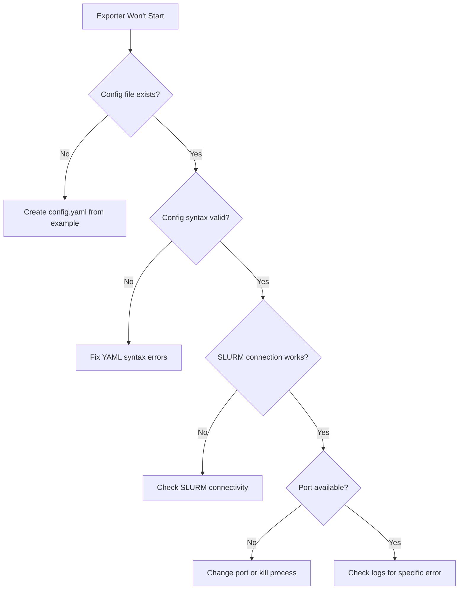
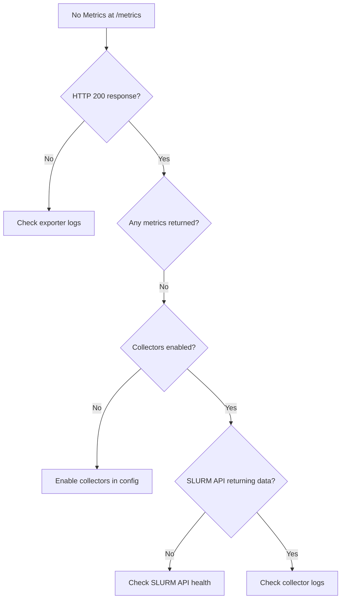
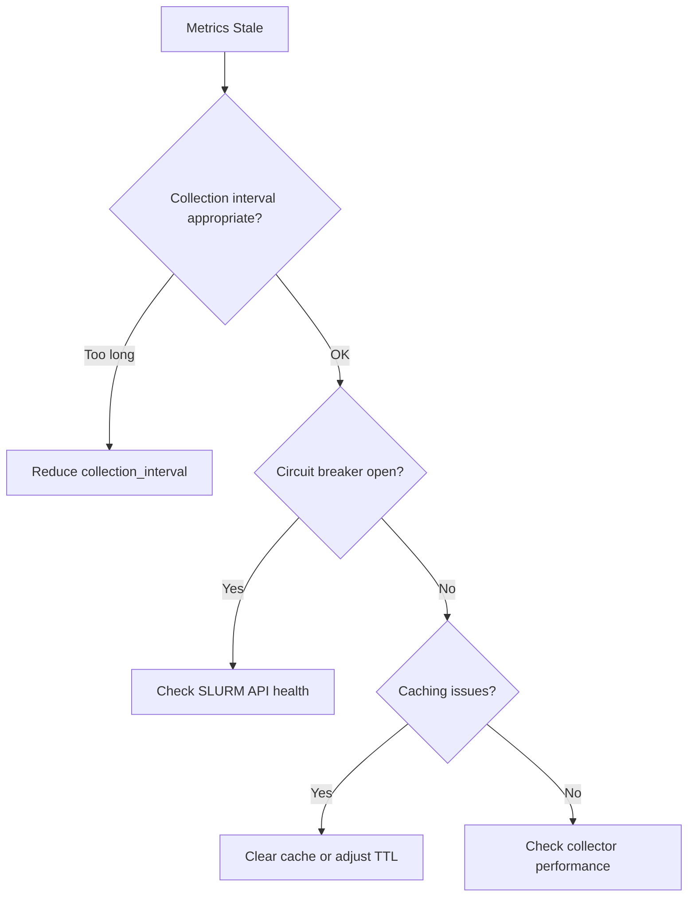
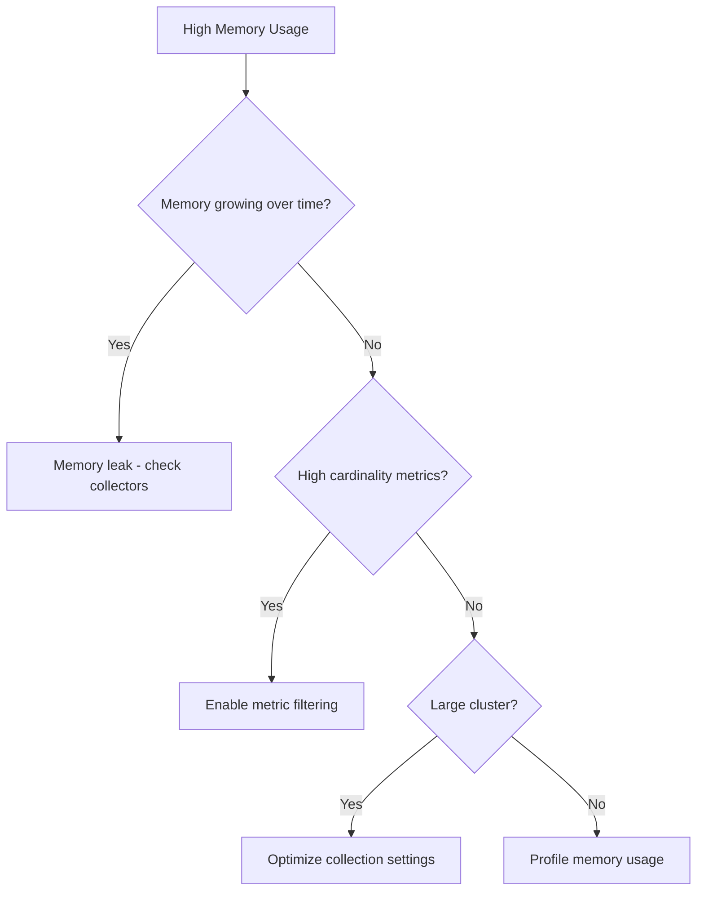
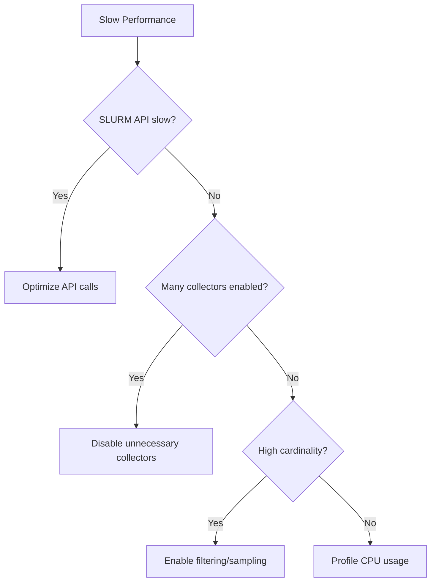

# SLURM Exporter Troubleshooting Guide

This comprehensive troubleshooting guide provides decision trees and solutions for common issues with the SLURM Exporter.

## 🚀 Quick Health Check

Before diving into specific issues, run this quick health check:

```bash
# Check exporter health
curl http://localhost:8080/health

# Check metrics endpoint
curl http://localhost:8080/metrics | head -20

# Check debug endpoints
curl http://localhost:8080/debug/collectors
curl http://localhost:8080/debug/health
```

## 📊 Issue Decision Tree

### 1. Exporter Won't Start



#### Solutions:

**Config Issues:**
```bash
# Validate config syntax
go run cmd/validate-config/main.go config.yaml

# Use minimal config for testing
cat > minimal-config.yaml << EOF
slurm:
  endpoint: "http://your-slurm-server:6820"
  auth:
    type: "token"
    token: "your-token"
collectors:
  - jobs_simple
  - nodes_simple
EOF
```

**SLURM Connectivity:**
```bash
# Test SLURM API directly
curl -H "X-SLURM-USER-TOKEN: your-token" \
     http://your-slurm-server:6820/slurm/v0.0.40/diag

# Check network connectivity
telnet your-slurm-server 6820
```

**Port Conflicts:**
```bash
# Find process using port
sudo lsof -i :8080
sudo netstat -tulpn | grep :8080

# Kill conflicting process
sudo kill -9 <PID>
```

### 2. No Metrics Available



#### Solutions:

**Empty Metrics Response:**
```bash
# Check enabled collectors
curl http://localhost:8080/debug/collectors

# Enable basic collectors
cat >> config.yaml << EOF
collectors:
  - cluster_simple
  - jobs_simple
  - nodes_simple
  - partitions_simple
EOF
```

**SLURM API Issues:**
```bash
# Test specific endpoints
curl -H "X-SLURM-USER-TOKEN: $TOKEN" \
     $SLURM_ENDPOINT/slurm/v0.0.40/jobs

curl -H "X-SLURM-USER-TOKEN: $TOKEN" \
     $SLURM_ENDPOINT/slurm/v0.0.40/nodes
```

### 3. Metrics Outdated/Stale



#### Solutions:

**Adjust Collection Interval:**
```yaml
# config.yaml
performance:
  collection_interval: "30s"  # Reduce from default 60s
  
# For high-frequency monitoring
performance:
  collection_interval: "10s"
  cache:
    enabled: true
    base_ttl: "15s"
```

**Circuit Breaker Issues:**
```bash
# Check circuit breaker status
curl http://localhost:8080/debug/health | jq '.circuit_breaker'

# Reset if stuck open
curl -X POST http://localhost:8080/debug/circuit-breaker/reset
```

**Cache Management:**
```bash
# Check cache stats
curl http://localhost:8080/debug/cache

# Clear cache
curl -X POST http://localhost:8080/debug/cache/clear
```

### 4. High Memory Usage



#### Solutions:

**Enable Metric Filtering:**
```yaml
# config.yaml
filtering:
  enabled: true
  max_cardinality: 10000
  patterns:
    jobs:
      exclude_users: ["test_*", "temp_*"]
      exclude_partitions: ["debug"]
    nodes:
      exclude_states: ["unknown"]
```

**Optimize for Large Clusters:**
```yaml
performance:
  collection_interval: "60s"
  batch_processing:
    enabled: true
    batch_size: 100
  cache:
    enabled: true
    base_ttl: "120s"
```

**Memory Profiling:**
```bash
# Enable profiling
curl http://localhost:8080/debug/pprof/heap > heap.prof
go tool pprof heap.prof

# Check memory stats
curl http://localhost:8080/debug/memory
```

### 5. Slow Performance



#### Solutions:

**Optimize API Calls:**
```yaml
# config.yaml
slurm:
  timeout: "10s"
  retry_attempts: 2
  
performance:
  batch_processing:
    enabled: true
    batch_size: 50
  connection_pool:
    max_connections: 5
```

**Selective Collectors:**
```yaml
# Disable heavy collectors for large clusters
collectors:
  - cluster_simple      # Lightweight cluster info
  - jobs_simple        # Basic job metrics only
  - nodes_simple       # Basic node metrics only
  # - job_performance  # Disable detailed job metrics
  # - job_analytics    # Disable analytics
```

**Performance Profiling:**
```bash
# CPU profiling
curl http://localhost:8080/debug/pprof/profile > cpu.prof
go tool pprof cpu.prof

# Collection performance
curl http://localhost:8080/debug/collectors | jq '.performance'
```

## 🔧 Common Configuration Issues

### Authentication Problems

**Token Authentication:**
```yaml
slurm:
  auth:
    type: "token"
    token: "your-slurm-user-token"
    # Token should have appropriate SLURM permissions
```

**JWT Authentication:**
```yaml
slurm:
  auth:
    type: "jwt"
    jwt:
      key_file: "/path/to/jwt.key"
      user: "slurm-exporter"
```

**Certificate Authentication:**
```yaml
slurm:
  auth:
    type: "certificate"
    certificate:
      cert_file: "/path/to/client.crt"
      key_file: "/path/to/client.key"
      ca_file: "/path/to/ca.crt"
```

### Network Configuration

**Firewall Issues:**
```bash
# Check if SLURM port is accessible
telnet slurm-server 6820

# For Kubernetes
kubectl exec -it slurm-exporter-pod -- telnet slurm-server 6820
```

**DNS Resolution:**
```bash
# Test DNS resolution
nslookup slurm-server

# Use IP address if DNS fails
slurm:
  endpoint: "http://10.0.1.100:6820"
```

## 📈 Monitoring the Exporter

### Health Monitoring

```bash
# Comprehensive health check
curl http://localhost:8080/debug/health | jq '.'

# Example healthy response:
{
  "status": "healthy",
  "slurm_api": "connected",
  "collectors": {
    "enabled": 5,
    "healthy": 5,
    "errors": 0
  },
  "memory": {
    "usage_mb": 45,
    "gc_cycles": 12
  },
  "circuit_breaker": "closed"
}
```

### Performance Monitoring

```bash
# Collection performance
curl http://localhost:8080/debug/collectors | jq '.performance'

# Cache effectiveness
curl http://localhost:8080/debug/cache | jq '.stats'

# Connection pool status
curl http://localhost:8080/debug/connections
```

## 🚨 Emergency Procedures

### Exporter Stuck/Unresponsive

```bash
# Graceful restart
curl -X POST http://localhost:8080/debug/restart

# Force restart (last resort)
sudo systemctl restart slurm-exporter

# Or for containers
docker restart slurm-exporter
kubectl rollout restart deployment/slurm-exporter
```

### SLURM API Overload

```bash
# Enable circuit breaker protection
curl -X POST http://localhost:8080/debug/circuit-breaker/enable

# Reduce collection frequency
curl -X POST http://localhost:8080/debug/config/collection-interval/300s

# Disable heavy collectors temporarily
curl -X POST http://localhost:8080/debug/collectors/disable/job_analytics
```

### High Resource Usage

```bash
# Enable emergency mode (minimal collectors only)
curl -X POST http://localhost:8080/debug/emergency-mode/enable

# Clear all caches
curl -X POST http://localhost:8080/debug/cache/clear

# Force garbage collection
curl -X POST http://localhost:8080/debug/gc
```

## 📝 Log Analysis

### Common Log Patterns

**Authentication Errors:**
```
ERROR: SLURM API authentication failed: invalid token
```
**Solution:** Verify token is valid and has correct permissions

**Connection Timeouts:**
```
ERROR: timeout connecting to SLURM API after 30s
```
**Solution:** Increase timeout or check network connectivity

**Circuit Breaker Activation:**
```
WARN: Circuit breaker opened due to repeated failures
```
**Solution:** Check SLURM API health, will auto-recover when healthy

**Memory Warnings:**
```
WARN: High memory usage detected: 512MB
```
**Solution:** Enable filtering or reduce collection frequency

### Enabling Debug Logging

```yaml
# config.yaml
logging:
  level: "debug"
  format: "json"
  output: "/var/log/slurm-exporter.log"

# Or via environment
export LOG_LEVEL=debug
export LOG_FORMAT=json
```

## 🔍 Advanced Debugging

### Request Tracing

```yaml
# Enable OpenTelemetry tracing
tracing:
  enabled: true
  endpoint: "http://jaeger:14268/api/traces"
  sample_rate: 0.1  # 10% sampling for production
```

### Profiling Production Issues

```bash
# CPU profile for 30 seconds
curl "http://localhost:8080/debug/pprof/profile?seconds=30" > cpu.prof

# Memory heap dump
curl http://localhost:8080/debug/pprof/heap > heap.prof

# Goroutine analysis
curl http://localhost:8080/debug/pprof/goroutine > goroutines.prof
```

### Custom Diagnostics

```bash
# Generate diagnostic report
curl http://localhost:8080/debug/diagnostic-report > diagnostic.json

# Example report includes:
# - Configuration summary
# - Collector status
# - Performance metrics
# - Recent errors
# - System information
```

## 🆘 Getting Help

### Before Reporting Issues

1. **Collect diagnostic information:**
   ```bash
   curl http://localhost:8080/debug/diagnostic-report > diagnostic.json
   ```

2. **Check logs for errors:**
   ```bash
   journalctl -u slurm-exporter -n 100
   # or
   docker logs slurm-exporter --tail 100
   ```

3. **Test SLURM API directly:**
   ```bash
   curl -H "X-SLURM-USER-TOKEN: $TOKEN" $SLURM_ENDPOINT/slurm/v0.0.40/diag
   ```

### Reporting Bugs

Include in your bug report:
- Diagnostic report (`diagnostic.json`)
- Relevant log excerpts
- Configuration file (with secrets redacted)
- SLURM version and cluster size
- Exporter version and deployment method

### Community Resources

- **GitHub Issues:** https://github.com/jontk/slurm-exporter/issues
- **GitHub Discussions:** https://github.com/jontk/slurm-exporter/discussions
- **Documentation:** https://github.com/jontk/slurm-exporter/tree/main/docs

---

*This troubleshooting guide is automatically updated with new scenarios. For the latest version, see the online documentation.*

## Table of Contents

- [Legacy Documentation](#legacy-documentation)
- [Connection Issues](#connection-issues)
- [Authentication Problems](#authentication-problems)
- [Performance Issues](#performance-issues)
- [Metric Collection Problems](#metric-collection-problems)
- [Kubernetes Deployment Issues](#kubernetes-deployment-issues)
- [Configuration Problems](#configuration-problems)
- [Resource Constraints](#resource-constraints)
- [Monitoring and Alerting Issues](#monitoring-and-alerting-issues)
- [Debugging Tools](#debugging-tools)

## Legacy Documentation

## Connection Issues

### SLURM REST API Connection Failed

**Symptoms:**
- Log messages like `Failed to connect to SLURM REST API`
- Health check endpoint returns unhealthy
- No metrics being collected

**Common Causes & Solutions:**

1. **Incorrect API URL**
   ```bash
   # Check if SLURM REST API is accessible
   curl -k https://your-slurm-server:6820/slurm/v0.0.40/diag
   
   # Verify configuration
   grep -i url /etc/slurm-exporter/config.yaml
   ```

2. **Network connectivity issues**
   ```bash
   # Test network connectivity
   telnet your-slurm-server 6820
   
   # Check DNS resolution
   nslookup your-slurm-server
   
   # Test with curl
   curl -v https://your-slurm-server:6820/slurm/v0.0.40/ping
   ```

3. **TLS/SSL certificate problems**
   ```bash
   # Test with TLS verification disabled
   curl -k https://your-slurm-server:6820/slurm/v0.0.40/ping
   
   # Check certificate
   openssl s_client -connect your-slurm-server:6820 -showcerts
   ```

**Resolution:**
```yaml
# config.yaml - For self-signed certificates
slurm:
  url: "https://your-slurm-server:6820"
  tls_skip_verify: true  # Only for testing
  
# For proper certificate validation
slurm:
  url: "https://your-slurm-server:6820"
  ca_cert_file: "/path/to/ca-bundle.pem"
```

### Connection Timeouts

**Symptoms:**
- Intermittent connection failures
- Slow metric collection
- Timeout errors in logs

**Solutions:**

1. **Increase timeout values**
   ```yaml
   slurm:
     timeout: 30s      # Increase from default 10s
     retry_attempts: 3
     retry_delay: 5s
   ```

2. **Check SLURM API performance**
   ```bash
   # Time API responses
   time curl -k https://your-slurm-server:6820/slurm/v0.0.40/nodes
   
   # Check SLURM controller load
   scontrol show config | grep -i max
   ```

## Authentication Problems

### JWT Token Authentication Failed

**Symptoms:**
- HTTP 401 Unauthorized errors
- Log messages about invalid tokens
- Authentication header issues

**Solutions:**

1. **Verify token format and expiration**
   ```bash
   # Decode JWT token (without verification)
   echo "your-jwt-token" | base64 -d
   
   # Check token expiration
   python3 -c "
   import jwt
   import datetime
   token = 'your-jwt-token'
   decoded = jwt.decode(token, options={'verify_signature': False})
   print('Expires:', datetime.datetime.fromtimestamp(decoded['exp']))
   "
   ```

2. **Generate new token**
   ```bash
   # Using scontrol (SLURM 21.08+)
   scontrol token
   
   # Or use JWT generation tool
   jwt encode --secret="your-secret" --exp="+1 day" user=slurm-exporter
   ```

3. **Configure token in exporter**
   ```yaml
   slurm:
     auth:
       type: "jwt"
       token: "your-jwt-token"
   ```

### API Key Authentication Issues

**Symptoms:**
- API key rejected by SLURM
- Inconsistent authentication behavior

**Solutions:**

1. **Verify API key format**
   ```bash
   # Test API key directly
   curl -H "X-SLURM-USER-NAME: slurm-exporter" \
        -H "X-SLURM-USER-TOKEN: your-api-key" \
        https://your-slurm-server:6820/slurm/v0.0.40/ping
   ```

2. **Check SLURM user permissions**
   ```bash
   # Verify user exists in SLURM
   sacctmgr show user slurm-exporter
   
   # Check associations
   sacctmgr show association user=slurm-exporter
   ```

## Performance Issues

### Slow Metric Collection

**Symptoms:**
- Long collection durations
- High CPU/memory usage
- Collection timeouts

**Solutions:**

1. **Optimize collection intervals**
   ```yaml
   collection:
     intervals:
       cluster: 30s     # Reduce frequency for expensive calls
       jobs: 60s        # Jobs change less frequently
       nodes: 15s       # Nodes need frequent monitoring
   ```

2. **Enable selective collection**
   ```yaml
   collectors:
     cluster:
       enabled: true
     jobs:
       enabled: true
       max_jobs: 1000   # Limit job collection
     nodes:
       enabled: true
   ```

3. **Use connection pooling**
   ```yaml
   slurm:
     max_connections: 10
     keep_alive: true
     connection_timeout: 10s
   ```

### High Memory Usage

**Symptoms:**
- OOMKilled containers
- Memory usage constantly increasing
- Slow garbage collection

**Solutions:**

1. **Limit metric cardinality**
   ```yaml
   metrics:
     max_series: 50000
     label_limits:
       user: 1000      # Limit user metrics to top 1000
       partition: 50   # Limit partitions
   ```

2. **Adjust Go runtime settings**
   ```bash
   # Set environment variables
   export GOGC=100           # Default garbage collection
   export GOMEMLIMIT=500MiB  # Set memory limit
   ```

3. **Configure resource limits**
   ```yaml
   # Kubernetes
   resources:
     limits:
       memory: "1Gi"
     requests:
       memory: "256Mi"
   ```

## Metric Collection Problems

### Missing Metrics

**Symptoms:**
- Expected metrics not appearing in Prometheus
- Gaps in metric series
- Partial data collection

**Solutions:**

1. **Check collector status**
   ```bash
   # Query exporter health endpoint
   curl http://slurm-exporter:8080/health
   
   # Check specific collector metrics
   curl http://slurm-exporter:8080/metrics | grep slurm_exporter_collection
   ```

2. **Verify SLURM API responses**
   ```bash
   # Test individual endpoints
   curl -H "Authorization: Bearer your-token" \
        https://slurm-server:6820/slurm/v0.0.40/nodes
   
   curl -H "Authorization: Bearer your-token" \
        https://slurm-server:6820/slurm/v0.0.40/jobs
   ```

3. **Enable debug logging**
   ```yaml
   logging:
     level: debug
     format: json
   ```

### Incorrect Metric Values

**Symptoms:**
- Metrics show unexpected values
- Inconsistent data between SLURM commands and metrics
- Mathematical errors in calculations

**Solutions:**

1. **Compare with SLURM commands**
   ```bash
   # Cross-check node information
   sinfo -Nel
   curl http://slurm-exporter:8080/metrics | grep slurm_node_cpus_total
   
   # Verify job counts
   squeue | wc -l
   curl http://slurm-exporter:8080/metrics | grep slurm_cluster_jobs_total
   ```

2. **Check metric labeling**
   ```bash
   # Verify label consistency
   curl http://slurm-exporter:8080/metrics | grep slurm_node_state
   ```

3. **Review metric definitions**
   ```bash
   # Check help text
   curl http://slurm-exporter:8080/metrics | grep "# HELP slurm_"
   ```

## Kubernetes Deployment Issues

### Pod Startup Failures

**Symptoms:**
- Pods stuck in CrashLoopBackOff
- Init container failures
- Image pull errors

**Solutions:**

1. **Check pod logs**
   ```bash
   kubectl logs -l app=slurm-exporter
   kubectl describe pod -l app=slurm-exporter
   ```

2. **Verify image availability**
   ```bash
   # Test image pull
   docker pull your-registry/slurm-exporter:latest
   
   # Check registry access
   kubectl get secrets -o yaml | grep dockerconfig
   ```

3. **Check resource constraints**
   ```bash
   kubectl top pods
   kubectl describe nodes
   ```

### Service Discovery Issues

**Symptoms:**
- Prometheus not scraping metrics
- Service endpoints not found
- Network policy blocking access

**Solutions:**

1. **Verify service configuration**
   ```bash
   kubectl get svc slurm-exporter -o yaml
   kubectl get endpoints slurm-exporter
   ```

2. **Test service connectivity**
   ```bash
   # From within cluster
   kubectl run debug --image=busybox --rm -it -- sh
   wget -O- http://slurm-exporter:8080/metrics
   ```

3. **Check Prometheus configuration**
   ```bash
   kubectl get servicemonitor slurm-exporter -o yaml
   
   # Verify Prometheus targets
   curl http://prometheus:9090/api/v1/targets
   ```

### RBAC Permission Issues

**Symptoms:**
- Permission denied errors
- ServiceAccount authentication failures
- API access denied

**Solutions:**

1. **Verify RBAC configuration**
   ```bash
   kubectl get serviceaccount slurm-exporter
   kubectl get rolebinding,clusterrolebinding | grep slurm-exporter
   ```

2. **Test permissions**
   ```bash
   kubectl auth can-i get pods --as=system:serviceaccount:monitoring:slurm-exporter
   ```

3. **Check security contexts**
   ```bash
   kubectl get pod -l app=slurm-exporter -o yaml | grep -A10 securityContext
   ```

## Configuration Problems

### Invalid Configuration File

**Symptoms:**
- Application fails to start
- YAML parsing errors
- Configuration validation failures

**Solutions:**

1. **Validate YAML syntax**
   ```bash
   # Check YAML syntax
   yamllint config.yaml
   
   # Use Python to validate
   python3 -c "import yaml; yaml.safe_load(open('config.yaml'))"
   ```

2. **Test configuration**
   ```bash
   # Dry-run configuration
   ./slurm-exporter --config=config.yaml --dry-run
   
   # Validate against schema
   jsonschema -i config.yaml schema.json
   ```

### Environment Variable Override Issues

**Symptoms:**
- Environment variables not taking effect
- Unexpected configuration values
- Precedence problems

**Solutions:**

1. **Check environment variable format**
   ```bash
   # List all SLURM_EXPORTER_* variables
   env | grep SLURM_EXPORTER
   
   # Verify naming convention
   export SLURM_EXPORTER_SLURM_URL="https://slurm-server:6820"
   ```

2. **Debug configuration loading**
   ```yaml
   logging:
     level: debug
   ```

## Resource Constraints

### CPU Throttling

**Symptoms:**
- High CPU wait times
- Slow metric collection
- Increased response times

**Solutions:**

1. **Monitor CPU usage**
   ```bash
   # Check container CPU metrics
   kubectl top pods slurm-exporter
   
   # Monitor CPU throttling
   kubectl exec slurm-exporter -- cat /sys/fs/cgroup/cpu/cpu.stat
   ```

2. **Adjust resource limits**
   ```yaml
   resources:
     requests:
       cpu: "100m"
     limits:
       cpu: "500m"
   ```

### Storage Issues

**Symptoms:**
- Log file write failures
- Disk space errors
- Configuration file read errors

**Solutions:**

1. **Check disk usage**
   ```bash
   kubectl exec slurm-exporter -- df -h
   kubectl describe pv,pvc
   ```

2. **Configure log rotation**
   ```yaml
   logging:
     file: "/var/log/slurm-exporter.log"
     max_size: "100MB"
     max_backups: 3
     max_age: 7
   ```

## Monitoring and Alerting Issues

### Alert Fatigue

**Symptoms:**
- Too many false positive alerts
- Important alerts being ignored
- Alert storms during maintenance

**Solutions:**

1. **Tune alert thresholds**
   ```yaml
   # Adjust sensitivity
   - alert: HighCPUUtilization
     expr: cpu_usage > 0.85  # Increase from 0.80
     for: 15m                # Increase duration
   ```

2. **Implement alert suppression**
   ```yaml
   # Add maintenance window routing
   route:
     routes:
     - match:
         severity: info
       receiver: low-priority
   ```

3. **Use alert dependencies**
   ```yaml
   - alert: NodeDown
     expr: slurm_node_state{state="down"} == 1
   - alert: PartitionDegraded
     expr: slurm_partition_nodes_down > 0
     # Only fire if nodes are actually down
     for: 5m
   ```

### Grafana Dashboard Issues

**Symptoms:**
- Panels showing no data
- Query timeouts
- Incorrect visualizations

**Solutions:**

1. **Verify data source**
   ```bash
   # Test Prometheus connectivity
   curl http://prometheus:9090/api/v1/query?query=up
   ```

2. **Debug queries**
   ```promql
   # Test individual queries in Prometheus UI
   sum(slurm_node_cpus_total)
   rate(slurm_job_submissions_total[5m])
   ```

3. **Check time ranges**
   ```bash
   # Verify metric timestamps
   curl 'http://prometheus:9090/api/v1/query?query=slurm_cluster_info'
   ```

## Debugging Tools

### Log Analysis

```bash
# View recent logs
kubectl logs -l app=slurm-exporter --tail=100

# Follow logs in real-time
kubectl logs -l app=slurm-exporter -f

# Search for specific errors
kubectl logs -l app=slurm-exporter | grep -i "error\|failed\|timeout"

# Export logs for analysis
kubectl logs -l app=slurm-exporter --since=1h > slurm-exporter.log
```

### Metric Debugging

```bash
# Check exporter metrics
curl http://slurm-exporter:8080/metrics | grep slurm_exporter_

# Monitor collection performance
curl http://slurm-exporter:8080/metrics | grep collection_duration

# Check for collection errors
curl http://slurm-exporter:8080/metrics | grep collection_errors_total
```

### Network Debugging

```bash
# Test connectivity from pod
kubectl exec -it slurm-exporter -- nslookup slurm-controller
kubectl exec -it slurm-exporter -- telnet slurm-controller 6820

# Check network policies
kubectl get networkpolicy
kubectl describe networkpolicy slurm-exporter

# Monitor network traffic
kubectl exec -it slurm-exporter -- tcpdump -i eth0 port 6820
```

### Configuration Debugging

```bash
# Dump effective configuration
kubectl exec slurm-exporter -- cat /etc/slurm-exporter/config.yaml

# Check environment variables
kubectl exec slurm-exporter -- env | grep SLURM_EXPORTER

# Validate configuration
kubectl exec slurm-exporter -- /slurm-exporter --config=/etc/slurm-exporter/config.yaml --validate
```

## Getting Help

### Enable Debug Mode

```yaml
# Temporary debug configuration
logging:
  level: debug
  format: json

# Enable request tracing
slurm:
  debug: true
  trace_requests: true
```

### Collect Diagnostic Information

```bash
#!/bin/bash
# diagnostic-collect.sh

echo "=== SLURM Exporter Diagnostics ==="
echo "Date: $(date)"
echo "Version: $(kubectl exec slurm-exporter -- /slurm-exporter --version)"

echo -e "\n=== Configuration ==="
kubectl get configmap slurm-exporter-config -o yaml

echo -e "\n=== Pod Status ==="
kubectl describe pod -l app=slurm-exporter

echo -e "\n=== Recent Logs ==="
kubectl logs -l app=slurm-exporter --tail=50

echo -e "\n=== Metrics Sample ==="
curl -s http://slurm-exporter:8080/metrics | head -20

echo -e "\n=== Health Check ==="
curl -s http://slurm-exporter:8080/health
```

### Contact Support

When reporting issues, please include:

1. SLURM exporter version
2. SLURM version and configuration
3. Kubernetes version (if applicable)
4. Complete error messages and logs
5. Configuration files (sanitized)
6. Steps to reproduce the issue
7. Expected vs. actual behavior

Submit issues at: https://github.com/jontk/slurm-exporter/issues

## Common Error Patterns

### Connection Refused
```
Error: dial tcp 10.0.0.1:6820: connect: connection refused
```
**Solution:** Check if SLURM REST API daemon (slurmrestd) is running

### Permission Denied
```
Error: HTTP 403 Forbidden - insufficient privileges
```
**Solution:** Verify user permissions in SLURM accounting database

### Context Deadline Exceeded
```
Error: context deadline exceeded
```
**Solution:** Increase timeout values in configuration

### Certificate Verification Failed
```
Error: x509: certificate signed by unknown authority
```
**Solution:** Add CA certificate or set `tls_skip_verify: true` for testing

### Memory Limit Exceeded
```
Error: signal: killed (OOMKilled)
```
**Solution:** Increase memory limits or reduce metric cardinality