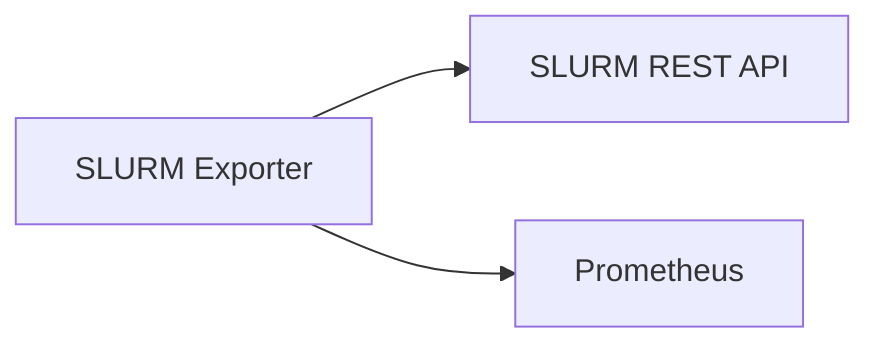
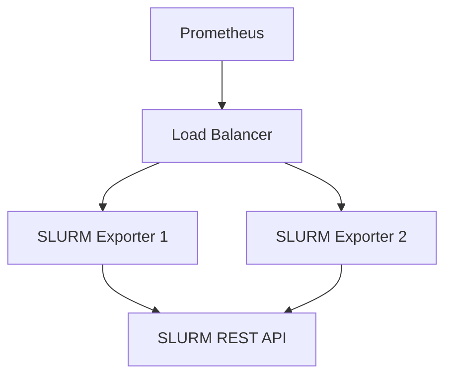
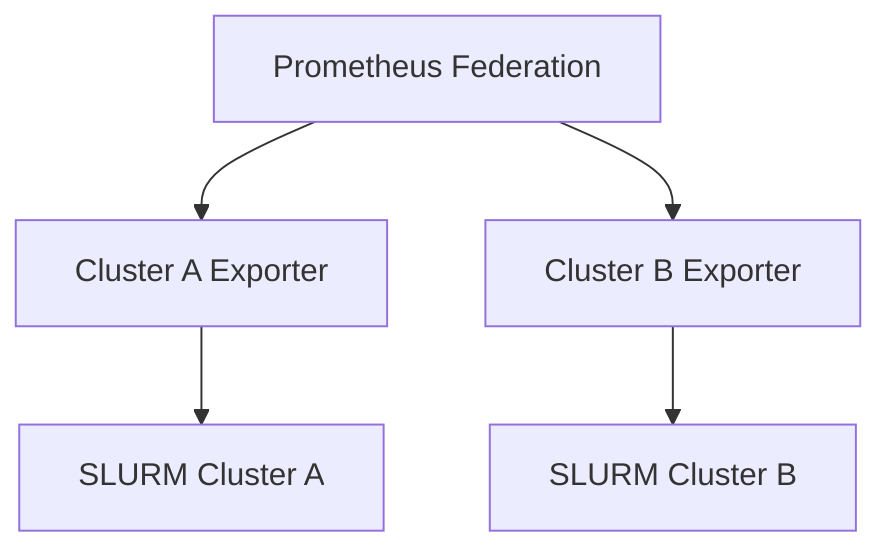

# Getting Started

Welcome to SLURM Exporter! This guide will help you get up and running quickly with monitoring your SLURM cluster.

## Overview

SLURM Exporter provides comprehensive monitoring for SLURM workload managers by exposing metrics in Prometheus format. Whether you're running a small research cluster or a large-scale HPC facility, SLURM Exporter scales to meet your monitoring needs.

## Prerequisites

Before installing SLURM Exporter, ensure you have:

### SLURM Environment
- **SLURM version**: 20.02+ (recommended: 22.05+)
- **SLURM REST API**: Enabled and accessible (slurmrestd)
- **API version**: v0.0.40 through v0.0.44 supported

### Infrastructure
- **Operating System**: Linux (RHEL/CentOS 7+, Ubuntu 18.04+, SLES 15+)
- **Architecture**: x86_64, arm64
- **Memory**: Minimum 512MB RAM (recommended: 2GB+)
- **CPU**: 1 core minimum (recommended: 2+ cores)
- **Network**: HTTP/HTTPS access to SLURM REST API

### Monitoring Stack
- **Prometheus**: 2.30+ for metric collection
- **Grafana**: 8.0+ for visualization (optional)
- **AlertManager**: For alerting (optional)

## Installation Methods

Choose the installation method that best fits your environment:

### :material-docker: Docker
Quick setup for testing and development environments.

[-> Docker Installation](installation.md#docker){ .md-button .md-button--primary }

### :material-package-variant: Package Manager
System packages for RHEL/CentOS, Ubuntu, and SUSE distributions.

[-> Package Installation](installation.md#packages){ .md-button }

### :material-hammer-wrench: From Source
Build from source for custom configurations or development.

[-> Build from Source](installation.md#source){ .md-button }

## Quick Start Paths

### :material-rocket-launch: 5-Minute Setup

Get basic monitoring running immediately:

1. **Deploy** with single command
2. **Configure** SLURM connection
3. **Verify** metrics collection
4. **View** in Prometheus

[-> Quick Start Guide](quickstart.md){ .md-button .md-button--primary }

### :material-cog: Production Setup

Complete production deployment with high availability:

1. **Plan** your architecture
2. **Configure** for production
3. **Deploy** with redundancy
4. **Monitor** the monitoring

<!-- [-> Production Guide](../deployment/production.md){ .md-button } -->

## Configuration Overview

SLURM Exporter uses a flexible YAML configuration system:

```yaml title="Basic Configuration"
# HTTP server settings
server:
  address: ":10341"
  metrics_path: "/metrics"
  health_path: "/health"
  ready_path: "/ready"

# SLURM connection settings
slurm:
  base_url: "http://slurm-controller.example.com:6820"
  api_version: "v0.0.44"
  auth:
    type: "jwt"
    username: "root"
    token: "your-jwt-token"
  timeout: 30s
  retry_attempts: 3
  retry_delay: 5s

# Collector settings
collectors:
  jobs:
    enabled: true
  nodes:
    enabled: true
  partitions:
    enabled: true

# Logging settings
logging:
  level: "info"
  format: "json"
```

[-> Full Configuration Reference](../user-guide/configuration.md){ .md-button }

## Key Concepts

### Collectors
Collectors gather specific types of metrics:
- **Jobs**: Job execution, queuing, resource usage
- **Nodes**: Node health, utilization, hardware
- **Partitions**: Queue status, limits, availability
- **Users**: User activity and resource usage
- **QoS**: Quality of Service policies
- **Reservations**: Reservation status and resources
- **System**: Cluster diagnostics and health
- **Cluster**: Cluster-level overview metrics

### Configuration Hot-Reload
SLURM Exporter supports hot-reloading configuration without restart by watching the config file for changes.

### Performance Features
- **Intelligent Caching**: Adaptive TTL reduces SLURM API load
- **Batch Processing**: Efficient bulk metric collection
- **Circuit Breaker**: Fault tolerance for SLURM API failures
- **Graceful Degradation**: Serves cached metrics when API is unavailable

## Architecture Patterns

### Single Exporter
Simple deployment for small to medium clusters:



### High Availability
Redundant deployment for production environments:



### Multi-Cluster
Federated monitoring across multiple SLURM clusters:



## What's Next?

Choose your next step based on your needs:

<div class="grid cards" markdown>

-   :material-timer-outline:{ .lg .middle } **New to SLURM Exporter?**

    ---

    Start with our quick start guide to get basic monitoring running in 5 minutes.

    [:octicons-arrow-right-24: Quick Start](quickstart.md)

-   :material-server:{ .lg .middle } **Production Deployment?**

    ---

    Jump to our production deployment guide for enterprise-grade setup.

    <!-- [:octicons-arrow-right-24: Production Guide](../deployment/production.md) -->

-   :material-chart-line:{ .lg .middle } **Advanced Features?**

    ---

    Explore job analytics, custom metrics, and advanced configuration options.

    [:octicons-arrow-right-24: Distributed Tracing](../advanced/tracing.md)

-   :material-help-circle:{ .lg .middle } **Need Help?**

    ---

    Check our troubleshooting guide or connect with the community.

    [:octicons-arrow-right-24: Troubleshooting](../user-guide/troubleshooting.md)

</div>

## Community & Support

- **GitHub**: [Report issues and contribute](https://github.com/jontk/slurm-exporter)
- **Documentation**: You're reading it!
- **Community**: Join discussions on SLURM community forums

---

Ready to start monitoring your SLURM cluster? Let's begin with the [installation guide](installation.md)!
