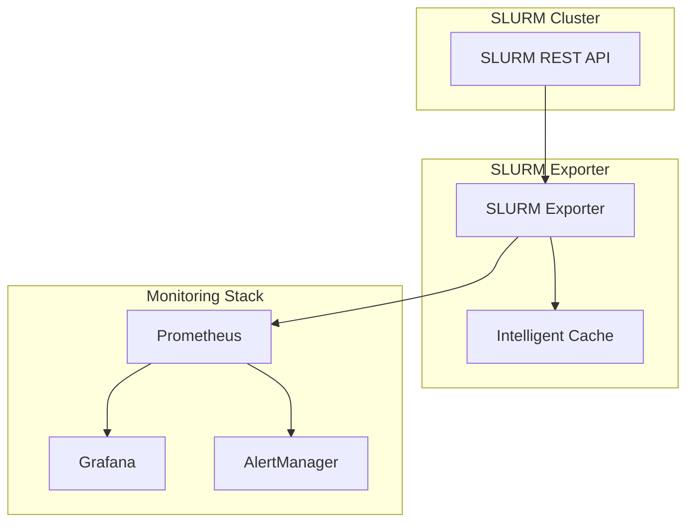

# SLURM Exporter

<div class="grid cards" markdown>

-   :material-rocket-launch-outline:{ .lg .middle } __Enterprise-Grade SLURM Monitoring__

    ---

    A comprehensive Prometheus exporter providing deep insights into SLURM workload manager performance, job analytics, and cluster health with enterprise-grade reliability and scalability.

    [:octicons-arrow-right-24: Getting started](getting-started/index.md)

-   :material-chart-line:{ .lg .middle } __Advanced Job Analytics__

    ---

    Built-in job analytics engine with SLURM-specific timing metrics, resource utilization analysis, efficiency scoring, and waste detection following Unix philosophy principles.

    [:octicons-arrow-right-24: Job Analytics](user-guide/job-analytics.md)

-   :material-kubernetes:{ .lg .middle } __Production Ready__

    ---

    Battle-tested deployment configurations for Kubernetes, Docker, and bare metal with high availability, security hardening, and performance optimization.

    <!-- [:octicons-arrow-right-24: Deployment Guide](deployment/index.md) -->

-   :material-monitor-dashboard:{ .lg .middle } __Rich Observability__

    ---

    Pre-built Grafana dashboards, Prometheus alerts, and comprehensive metrics covering jobs, nodes, partitions, fairshare, QoS, and cluster health.

    [:octicons-arrow-right-24: Metrics Catalog](user-guide/metrics.md)

</div>

## What is SLURM Exporter?

SLURM Exporter is a high-performance Prometheus exporter designed specifically for SLURM (Simple Linux Utility for Resource Management) workload managers. It provides comprehensive monitoring, analytics, and observability for HPC clusters, research computing environments, and large-scale batch processing systems.

### Key Features

#### :material-speedometer: **High Performance**
- Efficient data collection with configurable intervals per collector
- Intelligent caching with adaptive TTL
- Low memory footprint with cardinality optimization
- Batch processing for high-frequency metrics

#### :material-chart-analytics: **Comprehensive Collectors**
- **Jobs**: Job execution, scheduling, resource usage metrics
- **Nodes**: Node health, utilization, hardware metrics
- **Partitions**: Queue status, limits, availability
- **QoS**: Quality of Service policies and limits
- **Reservations**: Reservation status and resources
- **Users**: User activity and resource usage
- **System**: Cluster health and diagnostics

#### :material-security: **Enterprise Security**
- JWT authentication for SLURM REST API
- TLS encryption with certificate validation
- Basic authentication for metrics endpoint
- IP-based access control

#### :material-scale-balance: **Scalability & Reliability**
- Circuit breaker patterns for fault tolerance
- Graceful degradation under load with cached metrics
- Comprehensive health checks and self-monitoring
- Hot-reload configuration without restart

#### :material-kubernetes: **Cloud Native**
- Native Kubernetes support with Helm charts
- Multi-architecture container images (amd64, arm64)
- Scratch-based container image for minimal footprint
- Environment variable configuration with `SLURM_EXPORTER_` prefix

### Architecture Overview



### Quick Start

Get up and running in minutes:

=== "Docker"

    ```bash
    docker run -d \
      --name slurm-exporter \
      -p 10341:10341 \
      -v $(pwd)/config.yaml:/etc/slurm-exporter/config.yaml:ro \
      ghcr.io/jontk/slurm-exporter:latest
    ```

=== "Binary"

    ```bash
    # Download latest release
    curl -LO https://github.com/jontk/slurm-exporter/releases/latest/download/slurm-exporter-linux-amd64.tar.gz
    tar xzf slurm-exporter-linux-amd64.tar.gz

    # Configure and run
    ./slurm-exporter --config=config.yaml
    ```

## Why Choose SLURM Exporter?

### :material-target: **Purpose-Built for SLURM**
Unlike generic exporters, SLURM Exporter is specifically designed for SLURM environments with deep understanding of SLURM concepts like fairshare, QoS policies, and resource allocation patterns.

### :material-database-eye: **Comprehensive Coverage**
Monitor every aspect of your SLURM cluster:
- **Jobs**: Execution, scheduling, resource usage, efficiency
- **Nodes**: Health, utilization, hardware metrics
- **Partitions**: Availability, limits, queue depths
- **Users & Accounts**: Activity, quotas, usage patterns
- **System**: Cluster health, performance, capacity planning

### :material-tools: **Production Proven**
Deployed in production environments managing:
- **1000+** compute nodes
- **100,000+** daily jobs
- **Multi-petabyte** storage systems
- **24/7** mission-critical workloads

### :material-heart-handshake: **Community Driven**
Active open-source community with regular releases, comprehensive documentation, and responsive support from HPC professionals worldwide.

---

## Next Steps

<div class="grid cards" markdown>

-   :material-play-circle:{ .lg .middle } **Try it now**

    ---

    Follow our quick start guide to get SLURM Exporter running in your environment in under 5 minutes.

    [:octicons-arrow-right-24: Quick Start](getting-started/quickstart.md)

-   :material-book-open:{ .lg .middle } **Learn more**

    ---

    Explore our comprehensive user guide covering configuration, metrics, and best practices.

    [:octicons-arrow-right-24: Configuration](user-guide/configuration.md)

-   :material-github:{ .lg .middle } **Contribute**

    ---

    Join our community! Report bugs, request features, or contribute code to make SLURM Exporter even better.

    [:octicons-github-16: GitHub Repository](https://github.com/jontk/slurm-exporter)

-   :material-chat:{ .lg .middle } **Get help**

    ---

    Need support? Check our troubleshooting guide or connect with the community.

    [:octicons-arrow-right-24: Troubleshooting](user-guide/troubleshooting.md)

</div>
